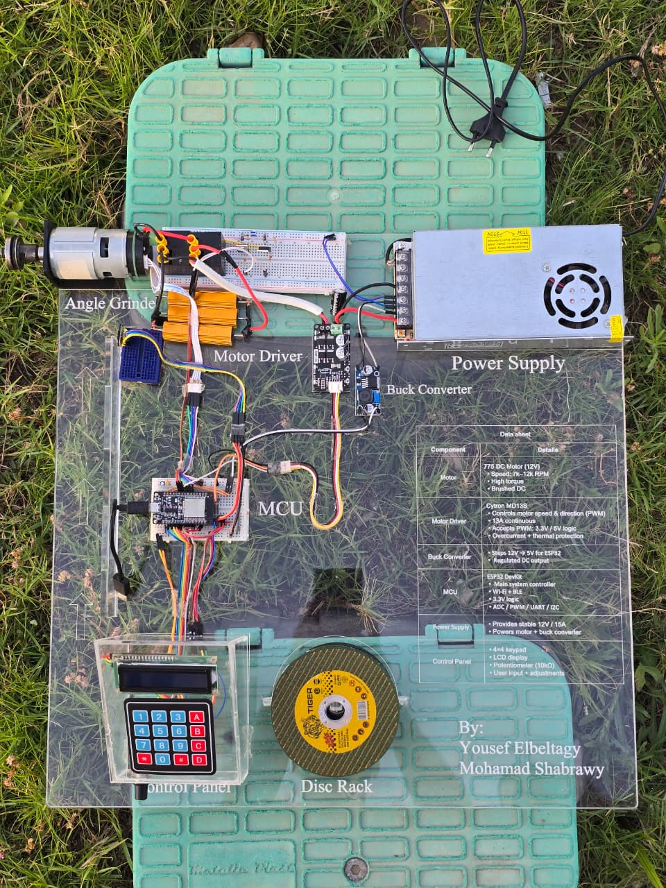
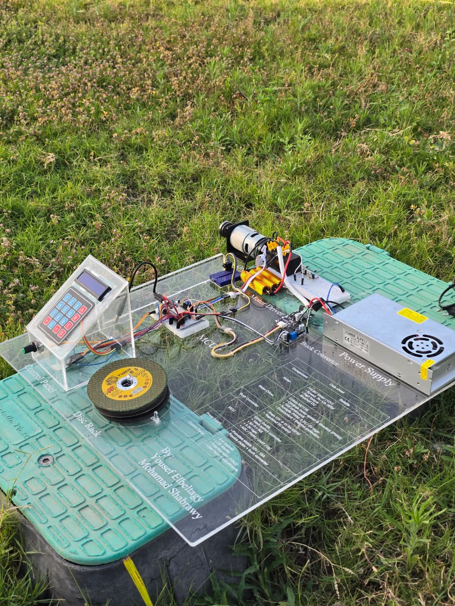
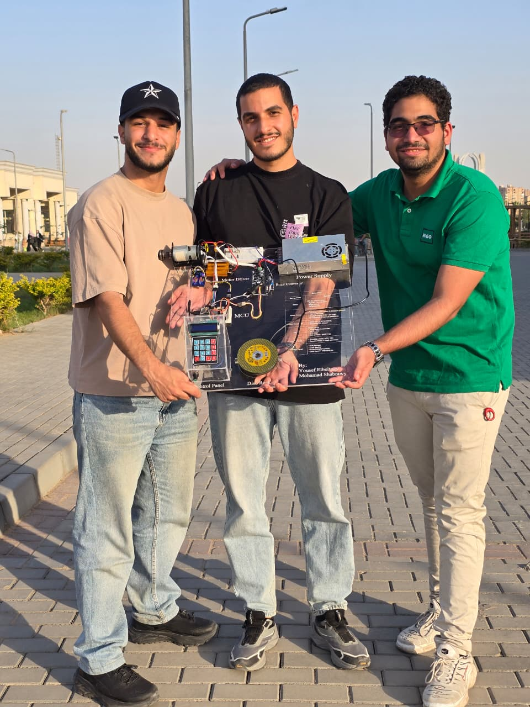
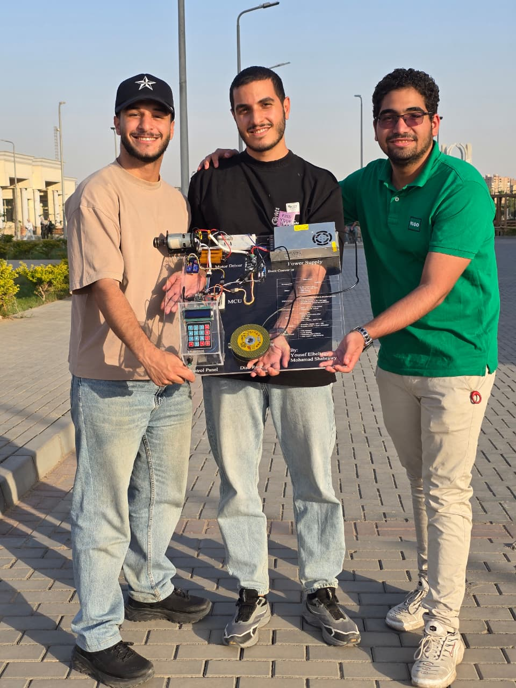

# Closed-Loop DC Motor Speed Control (ESP32 + Blynk IoT)

An IoT-enabled closed-loop speed control system for a **775 brushed DC motor** (0–12,000 RPM), built on an **ESP32** microcontroller. Combines a feed-forward duty-cycle model, adaptive bias correction, and a PID controller — controllable both locally and remotely via the **Blynk** cloud platform.

> **Phase 1 Course:** Electro-Mechanical Machines (POW2305) — Helwan National University, Robotics & Mechatronics Dept.  
> **Phase 2 Course:** Electrical Drives (POW2309)  
> **Team:** Youssef Ahmed Rady Elbeltagy · Mohamad Sherif Shabrawy · Amr Sherif Maher *(joined Phase 2)*

---

## Physical Build

| Hardware Top View | Hardware Side View |
|:---:|:---:|
|  |  |

| Team Photo | Team Photo |
|:---:|:---:|
|  |  |

---

## Project Phases

| | Phase 1 | Phase 2 |
|---|---|---|
| **Focus** | Full working system — firmware, PID control, IoT & physical build | Extended safety features & final presentation |
| **Deliverable** | Complete C firmware + assembled hardware prototype | Dynamic braking circuit, VL6180X sensor, 4×4 keypad upgrade + poster |
| **New in Phase 2** | — | Relay-based dynamic braking, VL6180X obstacle detection, A/B speed ramp keys, C key soft-stop/direction toggle, D key emergency brake |
| **Report** | [Phase 1 Report](docs/phase-1/Closed_Loop_DC_Motor_Report.pdf) | [Phase 2 Poster](docs/phase-2/Project_Poster.pdf) |

---

## System Overview

```
[Keypad / Potentiometer / Blynk App]
              ↓
         ESP32 DevKit
    ┌─────────────────────┐
    │  Feed-Forward Map   │  ← Lookup table (40 RPM→Duty points)
    │  + Adaptive Bias    │  ← Online learning correction
    │  + PID Controller   │  ← Kp=0.02, Ki=0.00015, Kd=0.0006
    └─────────────────────┘
              ↓
      Cytron MD13S Driver
              ↓
       775 DC Motor (12V)
              ↓
    Quadrature Encoder (28 CPR)
              ↑ feedback
```

---

## Features

| Feature | Details |
|---|---|
| Speed range | 0 – 12,000 RPM |
| Control law | Feed-Forward + PID with adaptive bias |
| Speed sensing | Quadrature encoder, 7 PPR × 4 = 28 CPR |
| RPM smoothing | Moving average filter, N=12 circular buffer |
| Input methods | 4×4 keypad, potentiometer, Blynk app |
| IoT platform | Blynk (Wi-Fi via ESP32) |
| Local display | I2C LCD 16×2 + mirrored Blynk LCD widget |
| Safety | Stall detection, overspeed protection, soft start/stop, safe direction change |
| PWM | 20 kHz, 10-bit resolution (GPIO 23 via LEDC) |
| **Dynamic braking** *(Phase 2)* | 2× SPDT relays + 3×1Ω/100W resistors in parallel (0.333Ω, 300W bank) — converts kinetic energy to heat for rapid stop |
| **Emergency obstacle detection** *(Phase 2)* | VL6180X ToF sensor — auto-triggers dynamic braking when object detected within 80 mm (~80–120 ms response) |
| **Speed ramping** *(Phase 2)* | A key = ramp up, B key = ramp down (10 RPM increments) |
| **Configurable soft-stop** *(Phase 2)* | C key (motor stopped) = set deceleration time 1–5 s |
| **Direction toggle** *(Phase 2)* | C key (motor running) = safe stop-then-reverse sequence |
| **Emergency brake key** *(Phase 2)* | D key = instant relay-based dynamic braking |

---

## Hardware

| Component | Spec |
|---|---|
| Microcontroller | ESP32 DevKit |
| Motor | 775 Brushed DC, 12V, 7,000–12,000 RPM |
| Motor Driver | Cytron MD13S (13A continuous) |
| Encoder | Quadrature, 7 PPR |
| Display | I2C LCD 16×2 (address 0x27) |
| Keypad | 4×4 matrix (Phase 2 upgrade from 4×3) |
| Power Supply | 12V, 15A |
| Buck Converter | 12V → 5V for ESP32 |
| **Relays** *(Phase 2)* | SONGLE SLC-12VDC-SL-C SPDT ×2 (12V coil, 30A contacts) |
| **MOSFET drivers** *(Phase 2)* | IRLZ44N ×2 (60V, 50A, logic-level gate) |
| **Braking resistors** *(Phase 2)* | RX24 1Ω/100W ×3 in parallel → 0.333Ω, 300W |
| **Flyback diodes** *(Phase 2)* | 1N4007 ×2 across relay coils |
| **Proximity sensor** *(Phase 2)* | VL6180X ToF via I2C (0–200 mm range) |

**Pin Configuration:**

| Signal | GPIO |
|---|---|
| PWM Output | 23 |
| Direction | 25 |
| Encoder A | 32 |
| Encoder B | 33 |
| Potentiometer | 36 (ADC) |
| Keypad Rows | 19, 18, 5, 17 |
| Keypad Cols | 2, 16, 4, 15 |
| Relay A (Phase 2) | 26 |
| Relay B (Phase 2) | 27 |
| VL6180X SDA (Phase 2) | 21 |
| VL6180X SCL (Phase 2) | 22 |

---

## Blynk Virtual Pin Mapping

| Pin | Role |
|---|---|
| V0 | Live RPM telemetry → graph |
| V1 | Target RPM setpoint (read/write) |
| V2 | Direction (0=Forward, 1=Reverse) |
| V3 | Master Start/Stop switch |
| V4 | Remote LCD widget |

---

## Getting Started

### 1. Install Libraries (Arduino IDE)

- `Blynk` (BlynkSimpleEsp32)
- `LiquidCrystal_I2C`
- `Keypad`

### 2. Configure Credentials

Open `src/Closed_Loop_Motor_Control.c` and fill in your details:

```c
#define BLYNK_TEMPLATE_ID   "YOUR_TEMPLATE_ID"
#define BLYNK_TEMPLATE_NAME "YOUR_TEMPLATE_NAME"
#define BLYNK_AUTH_TOKEN    "YOUR_BLYNK_AUTH_TOKEN"

char ssid[] = "YOUR_WIFI_SSID";
char pass[] = "YOUR_WIFI_PASSWORD";
```

### 3. Flash to ESP32

Open `src/Closed_Loop_Motor_Control.c` in Arduino IDE, select your ESP32 board and COM port, and upload.

### 4. Keypad Controls

| Key | Action |
|---|---|
| `0`–`9` | Type target RPM digit by digit |
| `#` | Confirm → select direction (1=FWD, 2=REV) → start motor |
| `*` | Emergency stop / reset / sync to potentiometer |
| `A` *(Phase 2)* | Hold to ramp speed **up** in 10 RPM increments |
| `B` *(Phase 2)* | Hold to ramp speed **down** in 10 RPM increments |
| `C` *(Phase 2, motor stopped)* | Configure soft-stop deceleration time (1–5 s) |
| `C` *(Phase 2, motor running)* | Toggle direction (safe stop-then-reverse) |
| `D` *(Phase 2)* | Instant **emergency dynamic braking** (relay circuit) |

---

## Control Architecture

### Feed-Forward + Adaptive Bias
A lookup table of ~40 RPM→Duty operating points linearizes the nonlinear motor curve. Linear interpolation finds the base duty for any target RPM. An **online adaptive bias** term updates in real-time when steady-state error persists (10–500 RPM range), compensating for load changes and voltage drop.

### PID Controller
Runs at 150 ms intervals on top of the feed-forward output:

```
u(t) = D_base + Kp·e(t) + Ki·∫e(t)dt + Kd·de(t)/dt
```

- Derivative low-pass filter: α = 0.62
- Integral windup clamp: ±12,000
- Deadband: ±5 RPM (prevents chattering)

### Safety Mechanisms
- **Stall detection:** stops motor if RPM < 20% of target for > 2 s
- **Overspeed protection:** halves duty if RPM > 130% of target for > 1 s
- **Soft start/stop:** ramped duty changes over 30 steps
- **Safe direction change:** direction only changes from full stop

---

## Project Structure

```
closed-loop-dc-motor-control/
├── src/
│   └── Closed_Loop_Motor_Control.c          # ESP32 firmware (C)
├── hardware/
│   └── circuit_layout.dwg                   # AutoCAD electrical layout
├── docs/
│   ├── phase-1/
│   │   └── Closed_Loop_DC_Motor_Report.pdf  # Phase 1 technical report
│   └── phase-2/
│       ├── Project_Poster.pdf               # Phase 2 poster/presentation
│       └── photos/                          # Physical build photos
├── .gitignore
└── README.md
```
